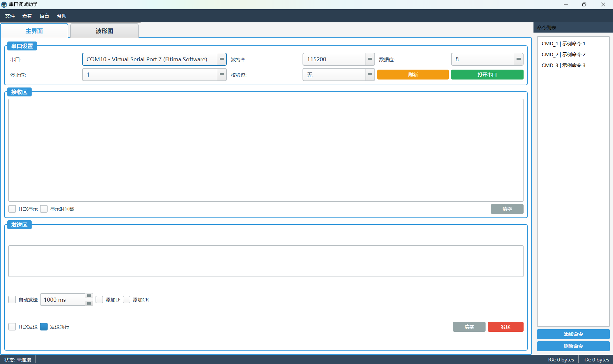
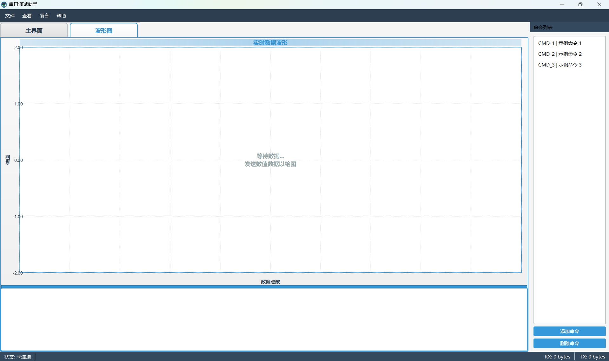

# 串口调试助手 / Serial Port Debugger

[](https://github.com/mojianbiao2025-art/SerialDebugger/actions/workflows/android-build.yml)
[](https://github.com/mojianbiao2025-art/SerialDebugger/actions/workflows/wasm-build.yml)

一个功能强大的跨平台串口调试工具，支持 Windows、Android 和 Web 浏览器。

## 功能特性

### 基础功能
- ✅ 串口通信（支持多种波特率、数据位、停止位、校验位）
- ✅ HEX 显示/发送模式
- ✅ 时间戳显示
- ✅ 自动发送功能
- ✅ 接收/发送字节计数
- ✅ 数据保存到文件

### 高级功能
- ✅ 实时数据波形绘制（6通道）
- ✅ 命令列表管理
- ✅ 多语言支持（中文、英文、日语、德语、法语）
- ✅ 现代化 UI 设计
- ✅ 自定义样式主题

### 平台支持
- ✅ Windows 7/8/10/11 (64-bit)
- ✅ Web 浏览器（Chrome 89+, Edge 89+, Opera 75+）
- 🚧 Android 5.0+ (需要 USB OTG 支持)

## 截图




## 下载

### 🌐 Web 版本（推荐）
- **在线使用**: [https://mojianbiao2025-art.github.io/SerialDebugger/](https://mojianbiao2025-art.github.io/SerialDebugger/)
- 无需安装，浏览器直接运行
- 支持 Chrome 89+, Edge 89+, Opera 75+
- 使用 Web Serial API 访问串口

### 💻 Windows 版本
- [最新版本下载](https://github.com/mojianbiao2025-art/SerialDebugger/releases/latest)
- 直接运行 `SerialDebugger.exe`

### 📱 Android 版本
- [APK 下载](https://github.com/mojianbiao2025-art/SerialDebugger/releases/latest)
- 需要 Android 5.0+ 和 USB OTG 支持

## 编译

### Windows

#### 前提条件
- Qt 5.6.3 或更高版本
- MSVC 2013 或更高版本
- CMake 3.5+

#### 编译步骤
```bash
# 克隆仓库
git clone https://github.com/mojianbiao2025-art/SerialDebugger.git
cd SerialDebugger

# 编译
.\build_simple.bat

# 运行
.\build\bin\SerialDebugger.exe
```

### WebAssembly (Web 版本)

#### 方法一：GitHub Actions 自动构建（推荐）
1. Fork 本仓库
2. 推送代码到 GitHub
3. 在 Actions 标签页查看构建进度
4. 自动部署到 GitHub Pages

#### 方法二：本地构建
详见 [BUILD_WASM.md](BUILD_WASM.md)

```bash
# 安装 Emscripten 和 Qt for WebAssembly
# 详细步骤见 BUILD_WASM.md

# 编译
.\build_wasm.bat

# 本地测试
cd build-wasm\deploy
python -m http.server 8000
# 访问 http://localhost:8000
```

### Android

#### 方法一：GitHub Actions 自动构建
1. Fork 本仓库
2. 推送代码到 GitHub
3. 在 Actions 标签页查看构建进度
4. 下载构建好的 APK

#### 方法二：本地构建
详见 [ANDROID_BUILD_GUIDE.md](ANDROID_BUILD_GUIDE.md)

## 使用说明

### 基本使用
1. 选择串口和参数（波特率、数据位等）
2. 点击"打开串口"
3. 在发送区输入数据
4. 点击"发送"按钮

### 数据绘图
1. 切换到"波形图"标签页
2. 发送格式：`plotter 1.23 4.56 7.89`
3. 或直接发送数字：`1.23 4.56 7.89`
4. 最多支持 6 个通道

### 切换语言
1. 点击菜单栏"语言"
2. 选择需要的语言
3. 界面立即切换

## 配置文件

### 语言配置
- `lang_en.ini` - 英语
- `lang_zh.ini` - 中文
- `lang_ja.ini` - 日语
- `lang_de.ini` - 德语
- `lang_fr.ini` - 法语

可以直接编辑这些文件来修改翻译。

### 样式配置
- `styles.qss` - 界面样式表

可以修改颜色、字体等样式。

## 技术栈

- **框架**: Qt 5.6.3+ / Qt 5.15.2 (WebAssembly)
- **语言**: C++11
- **构建**: CMake
- **串口**: Qt SerialPort / Web Serial API
- **绘图**: QPainter
- **Web**: Emscripten, WebAssembly

## 项目结构

```
SerialDebugger/
├── main.cpp                    # 主程序入口
├── mainwindow.h/cpp           # 主窗口
├── plotwidget.h/cpp           # 绘图控件
├── translations.h/cpp         # 翻译管理
├── webserialport.h/cpp        # Web Serial API 适配层
├── mainwindow.ui              # UI 设计文件
├── index.html                 # Web 版本主页
├── styles.qss                 # 样式表
├── lang_*.ini                 # 语言配置文件
├── CMakeLists.txt             # CMake 配置
├── build_simple.bat           # Windows 编译脚本
├── build_wasm.bat             # WebAssembly 编译脚本
├── android/                   # Android 配置
│   ├── AndroidManifest.xml
│   └── res/
└── .github/
    └── workflows/
        ├── android-build.yml  # Android 构建
        └── wasm-build.yml     # WebAssembly 构建
```

## 贡献

欢迎提交 Issue 和 Pull Request！

### 开发指南
1. Fork 本仓库
2. 创建特性分支 (`git checkout -b feature/AmazingFeature`)
3. 提交更改 (`git commit -m 'Add some AmazingFeature'`)
4. 推送到分支 (`git push origin feature/AmazingFeature`)
5. 开启 Pull Request

## 许可证

本项目采用 MIT 许可证 - 详见 [LICENSE](LICENSE) 文件

## 作者

**莫建标**
- 公司: 上海大族富创得股份有限公司
- Email: mojianbiao2025@gmail.com
- GitHub: [@mojianbiao2025-art](https://github.com/mojianbiao2025-art)

## 致谢

- Qt Framework
- Qt SerialPort Module
- 所有贡献者

## 常见问题

### Q: 找不到串口设备？
A: 
1. 检查串口驱动是否安装
2. 点击"刷新"按钮重新扫描
3. 确认设备已正确连接

### Q: Web 版本无法访问串口？
A: 
1. 确认使用 Chrome 89+、Edge 89+ 或 Opera 75+
2. 必须通过 HTTPS 或 localhost 访问
3. 首次使用需要手动授权串口访问
4. Firefox 和 Safari 暂不支持 Web Serial API

### Q: Android 版本找不到串口？
A: 
1. 确认设备支持 USB OTG
2. 授予 USB 权限
3. 检查 USB 转串口芯片是否支持

### Q: 如何修改界面语言？
A: 点击菜单栏"语言"选择需要的语言

### Q: 如何自定义界面样式？
A: 编辑 `styles.qss` 文件，修改颜色、字体等

## 更新日志

### v1.1.0 (2026-01-29)
- ✨ 新增 Web 版本支持
- ✨ 使用 Web Serial API 访问串口
- ✨ 支持 WebAssembly 编译
- ✨ GitHub Pages 自动部署
- ✨ 浏览器直接运行，无需安装

### v1.0.0 (2026-01-29)
- ✨ 初始版本发布
- ✨ 支持基础串口通信
- ✨ 支持数据波形绘制
- ✨ 支持 5 种语言
- ✨ 现代化 UI 设计
- ✨ Windows 平台支持
- 🚧 Android 平台开发中

## 路线图

- [x] Web 版本支持（WebAssembly + Web Serial API）
- [ ] 完善 Android 支持
- [ ] 添加蓝牙串口支持
- [ ] 添加网络串口支持
- [ ] 添加数据分析功能
- [ ] 添加脚本自动化
- [ ] 支持更多语言
- [ ] PWA 支持（离线使用）

## 支持

如果这个项目对你有帮助，请给个 ⭐️ Star！

有问题或建议？[提交 Issue](https://github.com/mojianbiao2025-art/SerialDebugger/issues)
